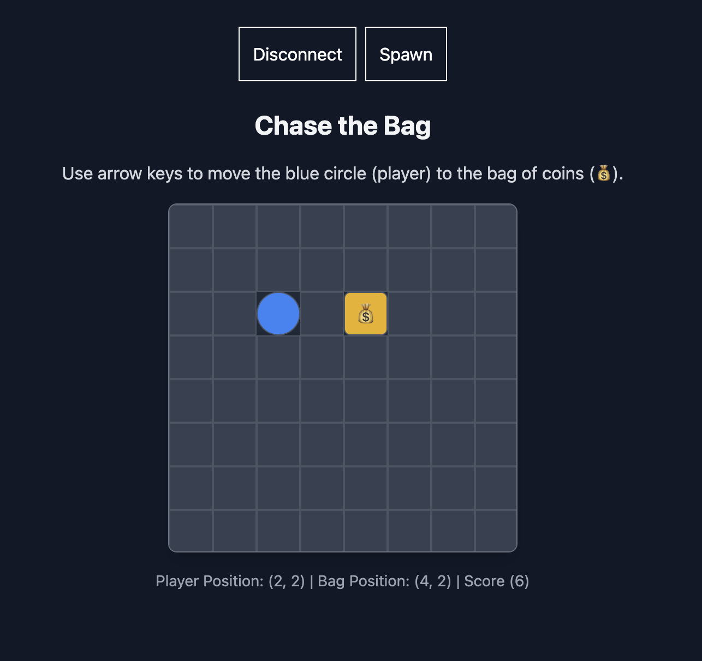

# Chase The Bag


A simple Dojo game that shows how to achieve the following:
- Write a simple Dojo contract that includes some game logic in the contract system, models, permissions, etc
- Integrate the contract to a frontend using Dojo.js
- Interact with the contract from the frontend

## Run project locally
> Before running project, ensure you have Dojo installed locally. Checkout [Dojo Docs](https://www.dojoengine.org/getting-started) for installation instructions.

**Terminal 1**

- Navigate to the `contract` directory
```bash
cd contract
```

- Spin up Katana
```bash
katana --dev --dev.no-fee --http.cors_origins "*"
```

**Terminal 2**

- Build project
```bash
sozo build
```

- Deploy to Katana
```bash
sozo migrate
```
> You will get a message similar to: _`⛩️  Migration successful with world at address 0x0193e3437b867035092ddd89f1c09281e51e2d21692457d6e8e65f680ee05fe8`_

- Index your world data using Torii
```bash
torii --http.cors_origins "*" --world <WORLD_ADDRESS>
```

> Use the world address you got from running `sozo migrate`

At this point, you should have deployed your world contract to Katana and have Torii indexing your world data.

**Terminal 3**
- Move into client directory
```bash
cd client
```

- Install dependencies
```bash
pnpm i
```

- Run client
```bash
pnpm dev
```

- Open client at `http://localhost:5173/`

## Extra resources
- [Dojo docs](https://www.dojoengine.org/)
- [Dojo 101](https://hackmd.io/@ibsdreamer/Hk1FXjdkgg)  
- [Set up Dojo engine](https://gist.github.com/0xibs/adb334a40260cc5109808de849e009fb) 
- [Deployment steps](https://gist.github.com/0xibs/c404313dbc00b1445e0e87c15591bb3c)